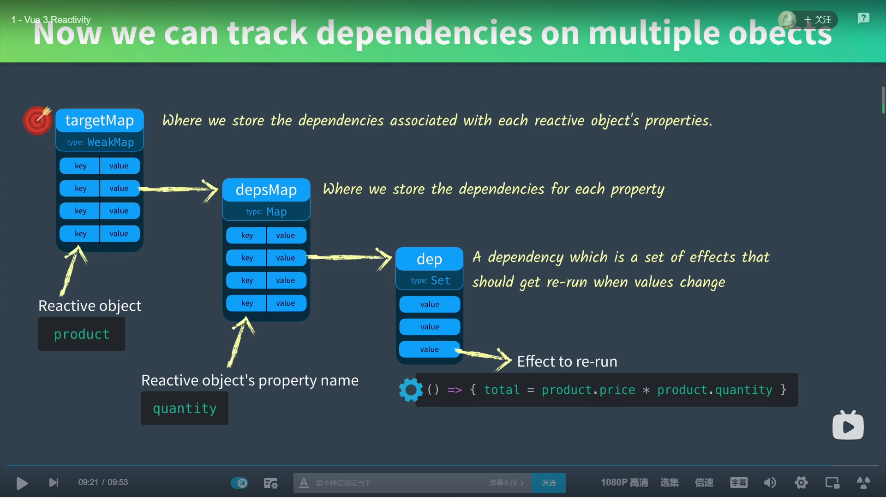

# Vue 3 Reactivity



```js
// 原理
// targetMap：用来存储每个对象关联的依赖
// depsMap：用来存储每个键对应的依赖
// dep：一个Set集合，用来收集effect函数
// effect函数的定义：所有在函数内部调用响应式变量的函数
const targetMap = new WeakMap()

function track(target, key) {
    let depsMap = targetMap.get(target);
    if (!depsMap) {
        targetMap.set(target, (depsMap = new Set()));
    }
    let dep = depsMap.get(key);
    if (!dep) {
        depsMap.set(key, (dep = new Set()));
    }
    dep.add(effect);
}

function trigger(target, key) {
    const depsMap = targetMap.get(target);
    if (!depsMap) return;
    const dep = depsMap.get(key);
    if (dep) {
        dep.forEach(effect);
    }
}


// 实列
let product = {price: 5, quantity: 2};
let total = 0;
let effect = () => {
    total = product.price * product.quantity
}
track(product, 'quantity');
effect();

// 运行
total -> 10
product.quantity = 3;
total -> 10
trigger(product, 'quantity');
total -> 15
```


到目前为止，已经有了存储不同effect函数的方法，但是还没实现让effect函数自动调用的功能。

（p s: 本章是通过手动调用trigger来执行effect函数的）